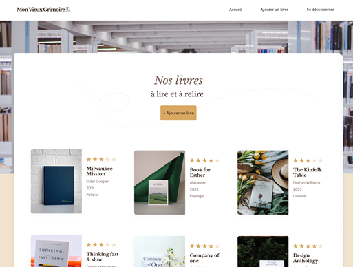
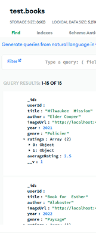

# Projet OC 6 - Mon Vieux Grimoire

<i>Travail réalisé lors de la formation "Développeur Web" d'OpenClassrooms.</i>


<p align="center">
  
  
</p>


## 🎞️ Scénario
<i>Vous êtes développeur back-end freelance dans la région de Lille depuis un an. Kévin, un développeur front-end expérimenté avec qui vous avez l'habitude de collaborer, vous propose de mutualiser vos compétences pour créer un site de référencement et de notation de livres pour une chaîne de librairies. Après avoir consulté les spécifications fonctionnelles et la maquette, vous acceptez cette mission avec enthousiasme.</i>
<br><br>

## 🎯 Objectifs
- Implémenter un modèle logique de données conforme à la réglementation
- Mettre en œuvre des opérations CRUD sécurisées.
- Assurer une gestion sécurisée de l'inscription et de l'authentification des utilisateurs avec hachage des mots de passe et du user ID.
- Stocker les données de manière sécurisée.
<br><br>

## 💡 Technologies utilisées
- Node.js
- Express
- MongoDB
- Helmet pour la sécurisation des headers HTTP
- Multer pour la gestion des fichiers (images)
- Sharp pour l'optimisation des images
<br><br>


## 📂 Structure
📁  OC_P6_MON-VIEUX-GRIMOIRE/<br>
│── 📁 backend/<br>
│    └── 📁 controllers/    # Logique métier<br>
│    └── 📁 middleware/     # Gestion de la sécurité (authentification, multer...)<br>
│    └── 📁 models/         # Modèles Mongoose<br>
│    └── 📁 routes/         # Déclaration des routes API<br>
│    └── 📁 utils/          # Fonctions utilitaires<br>
│    └── server.js          # Point d'entrée du serveur<br>
│──  README.md   
<br><br>

## 🚀 Installation
1. **Cloner** le dépôt GitHub :
   ```bash
   git clone git@github.com:HeleneC-cyber/OC_P6_MON-VIEUX-GRIMOIRE.git
2. **Naviguer** dans le répertoire du projet :
   ```bash
   cd backend
3. **Installer les dépendances** :
   ```bash
   npm install
4. ** Configurer** les variables d'environnement (créer un fichier.env)
5. **Lancer l'application** en mode développement
<br><br>


## 📝 Notes additionnelles
- Première expérience en développement back-end avec Node.js et Express.
- Gestion sécurisée des opérations CRUD et du stockage des données (MongoDB).
- Optimisation des images via Multer et Sharp.
- Sécurisation des endpoints avec Helmet et limitation des requêtes.
<br><br>


## 📬 Contact
Pour toute question ou suggestion, n'hésitez pas à me contacter sur [LinkedIn](https://www.linkedin.com/in/helene-canovas-48710b141/)